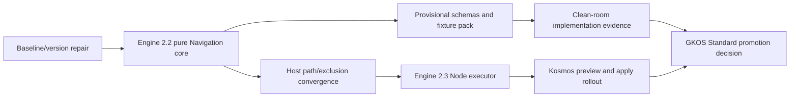

# Software Upgrade and Release Plan

## Upgrade objective

Introduce deterministic Navigation Projections without mixing unreleased Engine work, changing GKOS evidence semantics, or exposing source mutation before the recovery model is proven.

The plan deliberately uses separate minor releases for the pure planner and the reference writer. This limits blast radius, produces a usable early capability, and gives downstream hosts time to validate the contract before accepting mutation authority.

## Dependency order



## Phase 0 — Establish a truthful baseline

### Why this phase is mandatory

Engine main is two commits past `v2.0.1`, includes a substantial experimental scientific-research surface, and still reports `2.0.1`. The standard’s version policy expects source, package, exported version, tag, and compatibility declarations to agree outside an active release window. Navigation cannot be assigned a reliable version until that state is resolved.

### Preferred baseline release: Engine 2.1.0

1. Decide that the current post-`v2.0.1` main content belongs in the next release.
2. Set `package.json` and `src/version.ts` to `2.1.0`.
3. Update changelog/release notes and package/export documentation for the experimental-science additions.
4. Update Engine traceability from standard v0.77 to the actual standard coordinate being claimed, and update `docs/GKOS-REQUIREMENT-ADAPTER.md` from its stale Engine 2.0.0 label.
5. Repair standard `COMPAT.md` and reconcile it with `docs/implementation/VERSION_COMPATIBILITY_MATRIX.md`.
6. Fix incremental rename handling so record, projection, and diagnostic source paths move together.
7. Add a coordinate-consistency CI check.
8. Re-run type, test, package-content, license, and clean-install import checks; tag only after all agree.

If maintainers do not want the post-tag work in 2.1.0, they must explicitly create a clean release branch/revert path. In that alternative, Navigation may reclaim 2.1.0, but this packet does not prescribe history rewriting.

### Phase 0 acceptance

- `git describe`, package version, exported `ENGINE_VERSION`, release notes, and compatibility documents agree.
- Current Engine baseline remains at least 198 passing tests with the one known skip accounted for.
- Standard main tests and SRTP draft tests remain green.
- Rename fixtures prove no stale embedded source path.
- The decision about Engine-Lite version coupling is recorded and reflected in its package metadata.

### Workspace implementation start

The current workspace checkout (`c299472…`, package 1.0.4) should not be the branch point for Navigation. Preserve the untracked `build_instruct` material, establish the agreed 2.1.0/current-main baseline in a clean worktree or branch, re-run the baseline checks there, and implement from that point. Treat old `okf`/pre-GKX names in the local checkout as compatibility/migration cases, not as the new public API. No source merge or history rewrite is part of this assessment packet.

## Phase 1 — Engine 2.2.0: source-corpus-preserving Navigation core

### Deliverables

- `gkos-engine/navigation` pure API.
- Policy, ownership, plan, audit, and capability types.
- Packaged JSON Schemas listed in the schema rewrite.
- Exact-byte `NavigationSnapshotProvider` contract.
- Shared logical-path normalization and configurable prefix exclusion.
- MOC discovery with the eleven observed Kosmos names and folder-name priority.
- Published `gkos-navigation-folder-baseline/1.0.0` planner and `gkos-moc-markdown/1.0.0` renderer specifications with pinned digests.
- Navigation-only evidence masking for registered generated regions.
- Deterministic candidate rendering and plan-core digest.
- Context-pack assembly with item/UTF-8-byte limits.
- Mechanical Navigation audit.
- CLI: `nav discover`, `nav plan`, `nav diff`, and `nav audit`.
- Portable positive, adversarial, and golden fixtures.

### Source layout recommendation

```text
src/navigation/
  contracts.ts
  canonicalize.ts
  semantic-view.ts
  discovery.ts
  eligibility.ts
  ownership.ts
  planner.ts
  renderer.ts
  audit.ts
  incremental.ts
  diagnostics.ts
schemas/navigation/
docs/contracts/navigation/
test/navigation/
fixtures/navigation/
```

Required integration updates include `src/index.ts`, package exports, the build script, package-content checks, CLI help, license inventory, and import smoke tests.

### Engine file-level rewrite map

| Existing/new path | Planned change |
|---|---|
| `src/paths.ts` | Generalize exact-name ignores into one normalized path-policy API with configurable prefixes; retain the current helper as a compatibility wrapper. Do not replace cache hashes here with security digests. |
| `src/incremental.ts` | Repair embedded paths on rename and expose/forward the original source delta needed by Navigation. Preserve the existing `GraphDelta` API unless a separately versioned extension is approved. |
| `src/types.ts` | Add only shared public contract types that truly belong at the root; keep exact bytes and Navigation-only nodes in the Navigation namespace. |
| `src/navigation/*` | Add pure contracts, canonicalization, discovery, eligibility, ownership validation, planner, renderer, audit, and affected-scope logic. |
| `src/science/canonicalize.ts` | Leave scientific canonicalization semantics unchanged. Raw-byte SHA-256 belongs in a neutral new utility so science digests cannot be mistaken for archive digests. |
| `src/gkx-migration.ts` | Reuse only compatible low-level ID/digest concepts; do not make Navigation plans inherit timestamped migration-plan identity. Later migrate both workflows onto shared executor primitives. |
| `src/index.ts` and `package.json` | Export the pure Navigation surface and schemas; expose the Node executor only through an explicit platform subpath. |
| `bin/gkx.mjs` | Add the `nav` command group and preserve the source-corpus mutation boundary between plan/audit and ownership/apply/recover/rollback. |
| `scripts/build.mjs` | Bundle/type the new public subpaths without pulling Node filesystem code into the pure import. |
| `scripts/check-pack.mjs` | Pin the intended schemas, fixtures, types, and executables in the package-content contract. |
| `test/navigation/*` | Add golden, adversarial, cross-platform, sensitivity, feedback, crash, recovery, and package-import coverage. |

### Explicit exclusions

Engine 2.2.0 contains no target-file apply, rollback, archive pruning, direct LLM call, governed re-entry, or rich System Map state. Its CLI may write a plan/report path selected by the caller but must not mutate registered source targets.

### Phase 1 acceptance

- Gates G1–G3 from the collision plan pass.
- Identical fixtures produce byte-identical `plan_core`, candidate bytes, plan digest, and audit across supported Node versions and Windows/Linux/macOS runners.
- LF, CRLF, mixed-EOL, UTF-8 BOM, Unicode-path, case-collision, and invalid-UTF-8 cases have explicit outcomes.
- A second plan over unchanged evidence is a `no-op` even when a live generated region exists.
- Denied records are absent from output, counts, reasons, diffs, logs, and archives.
- Package/browser consumers can import the pure API without importing Node filesystem modules.

## Phase 2 — Provisional standards package and clean-room implementation

This phase can begin after the 2.2 contract freezes; standards promotion waits until it finishes.

1. Submit `NAV-PROPOSAL-001_Generated_Navigation_Projections.md` using the replacement text in this packet.
2. Add provisional schema copies and fixture manifests to `gkos-standard` with their exact SHA-256 values and status clearly marked non-normative.
3. Record which repository owns the canonical pre-promotion copy. CI must compare the Engine-packaged copy with the pinned proposal artifact so they cannot drift silently.
4. Commission a clean-room implementation that does not import, execute, or query Engine and does not use Engine output as an oracle.
5. Run both implementations against the same inputs; compare portable plan cores, candidate bytes, diagnostics, and audit metrics while allowing truthful implementation envelopes to differ. Adjudicate any semantic discrepancy from the written contract and fixture rationale.
6. Keep provisional results separate from conformance claims until the development decision is approved.

## Phase 3 — Engine 2.3.0: reference Node executor

### Prerequisites

- Engine 2.2.0 is stable.
- Ownership grants and marker handling pass hostile/adversarial fixtures.
- All source boundaries implement the shared archive-ignore predicate.
- Retention, legal-hold, and effective-sensitivity fields are defined.

### Deliverables

- Optional `gkos-engine/navigation/node` export and CLI executor.
- Raw-byte SHA-256 helper; no reuse of FNV or newline-normalizing digest paths.
- Explicit `nav ownership grant|revoke` workflow.
- Local workspace lease.
- Write-ahead run journal with per-operation transitions.
- Same-filesystem archive/write temporary files and per-file atomic replacement where supported.
- Remote conditional-write extension point.
- `nav apply`, `nav recover`, `nav rollback`, and `nav history`.
- Crash-injection harness and restart recovery.
- Capability-report schema and enforcement.
- Retention/legal-hold integration without automatic pruning.

### Phase 3 acceptance

- Gates G4 and G5 pass.
- Failure is injected before and after every journal transition, archive step, and replacement step.
- Every failure either leaves the original untouched, leaves the verified candidate with recoverable journal state, or produces a non-destructive conflict.
- Marker-only files remain unmanaged.
- Rollback refuses to overwrite any post-apply edit.
- A plan is refused after any source, policy, ownership, eligibility, or projection digest changes.
- Package upgrade/downgrade tests prove old journals remain inspectable and unknown schemas are never applied.

## Phase 4 — Kosmos-Oden staged adoption

### Kosmos 0.8.0: preview and parity

Recommended Engine pin: `2.2.x` at an exact release/tag according to repository policy.

- Replace the local MOC-name heuristic with Engine discovery as the primary path; retain the current heuristic behind a temporary compatibility flag.
- Add Navigation preview/diff/audit UI without mutation.
- Make plugin-vault, standalone-directory, and Nextcloud enumeration call the same normalized exclusion predicate.
- Ensure `_archive/moc-runs` and `.gkx` behavior is explicit for each provider.
- Preserve the Agent API as read-only.
- Advertise Navigation core capability and contract coordinate.
- Capture telemetry only if authorized and sensitivity-safe; never emit paths/titles from denied records.

### Kosmos 0.9.0: explicit apply

Recommended Engine pin: `2.3.x`.

- Implement or reuse the `NavigationApplyPort` in the existing write-capable migration boundary.
- Extract common archive/precondition/journal/recovery primitives rather than maintaining separate safety implementations for migration, enrichment, and Navigation.
- Add preview confirmation that binds the exact plan digest.
- Store local lease state outside a synchronized vault when possible.
- Use Nextcloud ETag/version preconditions; describe conflicts as optimistic concurrency.
- Add recovery UI before enabling a second apply after interruption.
- Capability-advertise writes separately from reads.

Kosmos may skip the intermediate product release and adopt Engine 2.3.x directly in one minor if maintainers prefer fewer releases, but it should still preserve two internal enablement stages: preview first, writes behind a default-off capability until recovery tests pass.

### Kosmos file-level rewrite map

| Path | Planned change |
|---|---|
| `src/renderer/cosmology.ts` | Delegate primary MOC classification to Engine Navigation; retain the current eleven-name/folder rule as a versioned fallback during migration. |
| `src/plugin/vault-provider.ts` | Apply the shared logical path/exclusion predicate before creating source snapshots; propagate complete source deltas. |
| `src/standalone/directory-source.ts` | Replace basename-only ignores with the shared normalized prefix-capable predicate. |
| `src/plugin/nextcloud-sync-core.ts` | Add version/ETag preconditions and map remote conflicts to Navigation executor states; do not claim distributed locking. |
| `src/plugin/gkx-migration.ts` | Extract shared archive, journal, precondition, recovery, and rollback services; keep workflow-specific plan schemas separate. |
| Agent API routes | Add plan/audit reads only if desired; do not expose ownership grant or apply. |
| Package/version metadata and tests | Pin the intended Engine minor, advertise contract/capabilities, and add host-parity fixtures. |

## Phase 5 — Standard promotion and broader consumers

Promotion occurs only after Engine, the clean-room planner, and at least one host executor produce the required evidence.

- Approve a development decision record.
- Allocate permanent requirement IDs through `requirements/REGISTRY.md`.
- Promote only the proven schemas from `schemas/provisional/navigation/`.
- Update compatibility/conformance manifests and release notes.
- Require each additional consumer to publish its supported Navigation contract, mode, and executor capabilities.

## Repository upgrade matrix

| Repository/product | Observed state | Recommended change | Version consequence |
|---|---|---|---|
| GKOS Engine | Main claims 2.0.1 with post-tag code | 2.1 baseline repair; 2.2 planner; 2.3 writer | Minor for each projection-observable contract tranche. |
| GKOS Standard | v0.78 family; compatibility drift | Proposal/provisional artifacts, then promotion after evidence | No immediate normative bump for Engine-only implementation; next governed release after decision. |
| Kosmos-Oden | 0.7.0, Engine v2.0.1 pin | 0.8 preview/parity; 0.9 apply/recovery | Minor whenever adopting a new Engine minor under current policy. |
| Engine-Lite | 1.1.3 thin wrapper | Reconcile version train; keep Navigation write commands out of its exposed surface | Follow the recorded Engine-Lite policy, not ad hoc feature versioning. |
| Kosmos-Oden-Lite | Frozen 1.0.6 | No Navigation; optional archive-ignore compatibility fix only | Patch at most. |
| KRS / Suite / Studio / private consumers | Not inspected in this review | Run contract fixtures and declare capabilities before adoption | Owner-determined; no write enablement by inference. |

## Backward-compatible adoption sequence for an existing vault

1. Audit the proposed archive prefix for pre-existing user corpus material, reserve or relocate it explicitly, and then upgrade every scanner with the same exclusion while no writer exists.
2. Run `nav discover` and save a report outside the managed targets.
3. Review classifications and fix false positives; no file is adopted automatically.
4. Select a target and explicitly grant `hybrid` or `managed` ownership, binding its activation digest or absence. For V1 hybrid adoption, first place and review the exact marker pair manually; grant does not insert it.
5. Generate and inspect a plan/diff.
6. Run mechanical audit and sensitivity checks.
7. Apply only with an executor that satisfies the policy’s capabilities and confirms the exact plan digest.
8. Verify the committed journal and a subsequent no-op plan.
9. Keep the archive and journal until retention/legal-hold policy permits governed disposition.

Unmanaged existing MOCs remain readable and reportable indefinitely. There is no forced migration.

## Test program

| Test family | Minimum coverage |
|---|---|
| Contract/schema | Every positive artifact; missing/unknown/wrong-type field adversarial cases; schema-version refusal. |
| Determinism | Repeated clocks/seeds, OS matrix, Node range, input enumeration permutations, path Unicode, candidate byte identity. |
| Semantic isolation | Generated-only, hybrid human region, two-run feedback, centrality/topology invariance. |
| Discovery | Eleven known stems, folder-name priority, case-folding, collisions, unmanaged/registered precedence. |
| Incremental | Change/remove/rename/folder/attachment, sensitivity-only, UID-only, policy/registry/eligibility change, full-rebuild fallback. |
| Security | Clearance plus compartments, denied-data noninterference, path traversal, symlink/reparse escape, malicious markers, log redaction. |
| Byte preservation | LF/CRLF/mixed, BOM, no terminal newline, untouched hybrid bytes, large file, invalid UTF-8 refusal. |
| Execution | Stale plan at every boundary, archive mismatch, disk full, permission loss, process kill, power-loss simulation, partial batch. |
| Recovery/rollback | Every operation state, candidate/base/neither live match, later edit conflict, repeated recovery idempotence. |
| Sync | Concurrent Nextcloud edits, stale ETag, offline/resume, duplicate client run, conflict-copy behavior. |
| Packaging | Clean install, every export subpath, browser-safe pure import, CLI smoke, tarball contents, license. |
| Compatibility | Existing Engine/Kosmos fixtures unchanged when Navigation disabled; archives ignored consistently. |
| Performance | Full and affected-scope planning on representative corpus sizes; peak memory including exact bytes. |

## Performance plan

Exact bytes increase memory pressure. The first implementation should establish baselines before promising incremental speedups:

- stream raw SHA-256 where possible;
- retain exact bytes only for targets and sources required by the current plan, or use a bounded snapshot store;
- measure full-plan wall time, peak RSS, candidate render time, and affected-scope ratio;
- fall back to a full plan when delta completeness is uncertain;
- never trade sensitivity filtering or stale-plan checks for performance.

Suggested release gates are empirical rather than invented here: capture representative small/medium/large corpora, publish the baseline, and require no regression beyond an explicitly approved budget.

## Rollback of the feature rollout

- Disabling Navigation leaves ordinary GKX parsing and graphing unchanged.
- Disabling the writer does not require deleting generated MOCs; scanners continue masking registered generated regions and ignoring archives.
- A product rollback must retain a reader for the newest journal schema it has created.
- Do not uninstall or downgrade past journal readability while a run is incomplete.
- Generated target rollback uses the digest-gated executor protocol, never a package-manager downgrade or blind file restore.

## Definition of done

The program is done only when:

- the Engine baseline is truthfully versioned;
- all seven release gates in the collision plan are evidenced;
- repeat planning is stable and feedback-free;
- write interruption is recoverable without guessing;
- Kosmos source providers agree on corpus membership;
- a clean-room planner passes portable fixtures;
- the standard’s promotion decision states exactly what became normative and what remains product behavior.
