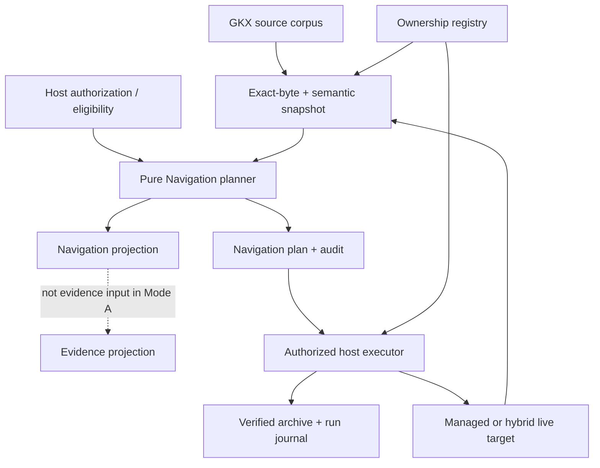

# Cross-Ecosystem Impact Analysis

## Overall impact

The reconciled Navigation capability has a favorable ecosystem profile: it adds a high-value derived view while leaving the GKOS evidence ontology stable. Most impact falls on source enumeration, capability/version declarations, fixtures, and host write safety—not on existing note schemas.

The principal ecosystem risk is accidental coupling: if every product independently discovers MOCs, filters sensitivity, renders candidates, and performs archives, behavior will drift. One pure planner contract plus explicit host executors prevents that drift while still respecting the standard’s independent-implementation requirement.

## Intended data flow

The dotted boundary is the essential semantic protection: the generated region remains visible to Navigation and to users, but it does not alter the evidence projection in Navigation-only mode.

## Impact by repository and product

| Surface | Benefit | Cost/risk | Required action | Evidence confidence |
|---|---|---|---|---|
| **GKOS Engine** | New reusable discovery, planning, context-pack, diff, and audit capability; stronger byte/delta/path infrastructure. | Larger public contract, memory cost for exact bytes, recovery responsibility in Node executor, additional release coordination. | Split 2.2 planner from 2.3 executor; fix baseline/version and incremental rename first. | High—current public main and tests inspected. |
| **GKOS Standard** | Clear derived-view semantics, sensitivity noninterference, implementation-independent fixtures, and a useful conformance profile without ontology churn. | Governance/review work; risk of over-standardizing product UI or premature schemas. | Proposal first; clean-room evidence; promote only proven requirements. | High—current standard, schemas, governance, and tests inspected. |
| **Kosmos-Oden plugin** | Better MOC precision, repeatable preview/diff, shared write recovery, reduced duplicated semantics. | Must converge vault enumeration and retrofit stronger journal/archive behavior; recovery UX is nontrivial. | Engine classifier primary; shared exclusions; preview in 0.8; explicit apply in 0.9. | High—relevant public source paths inspected. |
| **Kosmos standalone** | Same Navigation results as the plugin over directory corpora. | Current basename-only ignore logic cannot express a nested archive prefix safely. | Adopt shared normalized prefix predicate and contract fixtures. | High. |
| **Kosmos Nextcloud** | Portable plans and safer conditional writes. | No honest global transaction or distributed lock from a sync file; concurrent clients and conflict copies need explicit handling. | Use ETag/version preconditions plus local lease; expose partial/recovery states. | High for code constraints; deployment behavior still needs live integration tests. |
| **Kosmos Agent API** | Can expose richer read-only plans/audits to agents. | Pressure may arise to add write endpoints and conflate read/write authority. | Keep apply absent; use a separate authorized host workflow. | High—read-only boundary observed. |
| **Engine-Lite** | Can benefit from shared parser/path fixes and perhaps consume plan artifacts. | Version coupling is already unclear; expanding commands would violate its thin-surface intent. | Reconcile version policy; do not expose Navigation mutation commands by default. | Medium-high—public state inspected, but no release decision inferred. |
| **Kosmos-Oden-Lite** | Shared vaults avoid archive contamination if ignore behavior is patched. | Frozen patch-only line must not absorb a new feature. | No Navigation backport; optional narrow ignore patch only. | Medium-high. |
| **KRS and other Engine consumers** | Stable machine-readable plans and context packs can reduce bespoke corpus navigation. | Unknown UI, storage, and authorization assumptions; private/current code not assessed. | Run pure contract fixtures first; declare capabilities; writes remain off until owner evidence. | Low-to-medium—impact inferred from public contracts, not implementation inspection. |
| **Suite/Studio and other private products** | Potential common Navigation UX and fewer duplicated heuristics. | Unknown repositories may collide with filenames, locks, archives, or their own MOC ownership model. | Treat as unverified consumers and require an adoption worksheet/test report. | Low—no code claim is made. |
| **Plain Markdown/Obsidian users** | Human-readable MOCs remain ordinary files; hybrid mode preserves human prose. | Generated markers and sidecar ownership introduce concepts users must understand; manual edits inside a generated region will be replaced only after preview. | Clear UI indicators, unmanaged default, exact diff, recovery guidance. | Medium-high. |
| **Independent implementers** | Versioned schemas/fixtures create a portable target and reduce reliance on Engine internals. | Exact byte, canonicalization, path, and recovery requirements are demanding. | Implement planner from the standard candidate artifacts; no Engine oracle. | Prospective. |

## Semantic impact on GKOS

### What remains stable

- Layer-1 evidence remains the entry point for governed content.
- L6 Context Manifests retain their current meaning.
- Contradiction, branching, provenance, sensitivity, validity intervals, and epistemic state are not collapsed by navigation grouping.
- GKX 2.0 frontmatter and relation vocabularies remain unchanged.
- Existing corpora behave as before when Navigation is disabled and no ownership registry is present.

### What is added

- A derived Navigation Projection profile.
- A portable plan/audit artifact family.
- Explicit generator ownership distinct from file discovery.
- A standards-visible boundary between semantic adapters and persistence executors.
- A future, separately governed route for generated content to re-enter Layer 1.

### Why this helps the standard

GKOS gains an answer to an important practical objection: a rigorous corpus can remain usable without weakening its epistemic model. Navigation becomes testable infrastructure rather than an informal convention or a product-specific heuristic. The independent-implementation requirement also tests whether the specification is truly portable.

## Functional impact on Engine

### New capability surface

- MOC discovery and classification;
- deterministic candidate generation;
- semantic and byte diff;
- context-pack selection;
- reachability/staleness/ambiguity/leak audit;
- exact plan exchange among CLI and hosts;
- optional recoverable Node execution.

### Core changes with benefits outside Navigation

| Core change | Broader benefit |
|---|---|
| Raw-byte SHA-256 utility | Safer migration, export verification, provenance, and artifact checks. |
| Shared path policy | Consistent corpus membership across CLI and applications. |
| Rich source delta | Better incremental consumers beyond MOCs. |
| Rename metadata repair | Correct diagnostics/projection paths for all incremental users. |
| Capability schema | Honest behavior negotiation across hosts. |
| Write-ahead execution primitives | Reusable safety for migration and enrichment workflows. |
| Deterministic core/envelope split | Cleaner caching, signing, audit, and reproduction. |

### API compatibility

The pure Navigation API can be additive. Observable changes arise from:

- fixing rename output;
- changing default ignores when an archive tree exists;
- introducing masked generated regions when an ownership registry activates Navigation-only mode;
- adding package export paths;
- adding CLI commands;
- later adding mutation capability.

These deserve minor releases and explicit release notes even when existing method signatures remain source-compatible.

## Storage and synchronization impact

### Growth

Archive-before-replace intentionally increases storage. Worst-case growth is approximately the sum of prior target byte lengths per committed replacement plus journals and metadata. Deduplication/compression may reduce physical storage, but the contract must not assume it.

Controls:

- report projected archive bytes before apply;
- allow policy-based run selection, not automatic pruning;
- bind retention and legal-hold references;
- expose archive inventory without leaking sensitive paths to unauthorized users;
- use governed erasure with an audit/tombstone result.

### Sync behavior

For local files, a process lease prevents two local executors from starting together but cannot coordinate a remote client. For Nextcloud or similar services:

- bind operations to ETag/version plus raw digest;
- treat conflict copies as new unmanaged material until reviewed;
- recover one journal before starting another on that client;
- never advertise global multi-file atomicity;
- keep executor-local lease state outside the synchronized corpus where practical.

### Backup interaction

Navigation archives are operational history, not a replacement for a repository or backup system. Backup tools must preserve the ownership registry and run journals together with target/archive data according to sensitivity policy. Restoring only a target without its registry can safely degrade to unmanaged; restoring a registry without the matching file digest must not authorize apply.

## Security, privacy, and governance impact

### Positive impact

- Explicit eligibility and output sensitivity make derived views auditable.
- Default-unmanaged ownership reduces accidental overwrite.
- Raw preconditions prevent stale preview application.
- Journals make interruption and partial outcomes inspectable.
- Retention/legal-hold fields prevent archives from becoming invisible shadow data.

### New risks

| Risk | Control |
|---|---|
| Generated index reveals a secret title/path even when body is filtered | Host supplies complete eligibility; noninterference covers metadata, counts, reasons, and logs. |
| Marker spoof grants overwrite | Sidecar ownership registry plus activation/base digest. |
| Archive becomes a lower-security copy | Effective sensitivity inheritance and enforced storage capability. |
| Run history leaks operational structure | Journal inherits maximum revealed sensitivity; sanitized summaries are separate authorized outputs. |
| Rollback erases a later edit | Candidate-digest precondition; conflict rather than overwrite. |
| Retention cleanup violates legal hold | No automatic pruning; explicit policy and hold references. |
| Cross-device race | Optimistic version/ETag checks; no false distributed-lock claim. |
| Generated navigation is mistaken for evidence | Navigation-only masking and visible provenance/ownership labeling. |

### Authorization model change

Products need at least three permissions rather than one generic “vault access” flag:

1. read eligible evidence;
2. plan/view Navigation artifacts;
3. grant ownership and/or execute mutations.

Granting ownership is more privileged than planning. Applying a previously approved plan is separately auditable. The Agent API can support the first two without the third.

## User-experience impact

### Improvements

- predictable starting points in large folders/corpora;
- visible previews before generated changes;
- preservation of human prose in hybrid files;
- explicit “managed” status instead of heuristic overwrites;
- recoverable history and safer rollback;
- bounded context packages for human or authorized-agent work.

### Friction introduced intentionally

- existing MOCs are unmanaged until explicitly adopted;
- stale previews must be regenerated;
- malformed markers stop the operation;
- recovery may block new writes after interruption;
- sensitive output may contain fewer links than an authorized user expects if host eligibility is incomplete;
- archive retention requires administrative decisions.

Those costs are appropriate because a silent, convenient overwrite would conflict with GKOS’s provenance and authority model.

## Developer and operator impact

### Developers

- must distinguish evidence nodes from Navigation nodes;
- must carry exact bytes alongside parsed records at the planning boundary;
- must implement closed versioned schemas and canonical ordering;
- must not reuse convenience hashes for authorization;
- must expose source deltas before lossy graph-delta collapse;
- must test host path semantics, not assume POSIX behavior on Windows;
- must use executor/backend terminology for side effects.

### Operators

- need visibility into incomplete/partial runs and recovery actions;
- need archive storage/retention monitoring;
- need sensitivity-aware access to journals;
- need compatibility checks before package downgrade;
- need a procedure for synchronized conflicts and manually edited managed regions.

### Support and documentation

The support burden shifts from “why did the generator overwrite my file?” to explicit, diagnosable states: unmanaged, stale, recovery-required, or rollback-conflict. Product documentation should show those states and the exact safe next action.

## Impact of not proceeding

If Navigation is not added:

- Kosmos and other hosts are likely to retain or add their own MOC heuristics;
- corpus usability remains dependent on manual curation;
- context-pack selection stays product-specific;
- the standard loses a useful implementation-independence proving ground;
- migration/enrichment write safety may continue to evolve in parallel rather than around shared primitives.

If the proposal proceeds without reconciliation, the likely harms are worse than deferral: feedback-altered graphs, false write authority from markers, non-recoverable partial runs, metadata leaks, and standards claims based on a non-independent consumer.

## Success measures

### Release gates, not aspirational metrics

- Plan/candidate repeatability: byte-identical for identical versioned inputs.
- Evidence feedback delta in Navigation-only mode: zero.
- Sensitivity leakage in adversarial fixtures: zero.
- Stale plan acceptance: zero.
- Marker-only mutation acceptance: zero.
- Unrecoverable injected crash states: zero within the declared capability model.
- Rollback overwrites after later edit: zero.
- Eligible path-set mismatch among supported host providers: zero.
- Clean-room fixture parity: complete for every normative candidate fixture.

### Product measures after safe rollout

- percentage of discovered MOCs correctly classified after human review;
- reduction in unreachable eligible nodes;
- median and tail plan time/peak memory by corpus size;
- percentage of apply attempts that become stale before execution;
- recovery and conflict frequency by host;
- user corrections inside generated versus human-owned regions;
- archive growth per managed target and retention class.

Product measures must not become conformance requirements unless the standard later defines them.

## Recommended adoption decisions

| Capability | Recommendation |
|---|---|
| Discovery, plan, diff, mechanical audit | Build after baseline repair. |
| Navigation-only generated MOCs | Build with evidence masking and ownership registry. |
| Context packs | Build with item/byte budgets and host eligibility. |
| Node apply/recover/rollback | Build as a separately gated release. |
| Kosmos preview | Adopt early after Engine 2.2 fixtures pass. |
| Kosmos writes | Adopt only after Engine 2.3 recovery and provider-parity evidence. |
| Standard proposal/provisional fixtures | Begin after contract freeze. |
| Normative standard promotion | Wait for clean-room and host evidence. |
| Governed re-entry | Defer to its own proposal. |
| Direct LLM grouping | Defer; accept approved decisions only. |
| Rich System Map | Defer until states are deterministic. |
| Engine-Lite write surface | Do not add. |
| Kosmos-Oden-Lite feature backport | Do not add. |

## Final ecosystem judgment

The reconciled feature improves GKOS Standard by making derived navigation precise, portable, sensitivity-aware, and independently testable. It improves Engine by adding a high-value application layer and strengthening several foundational contracts. The change is worthwhile, but its success depends more on isolation, ownership, and recovery than on the MOC rendering algorithm itself.

