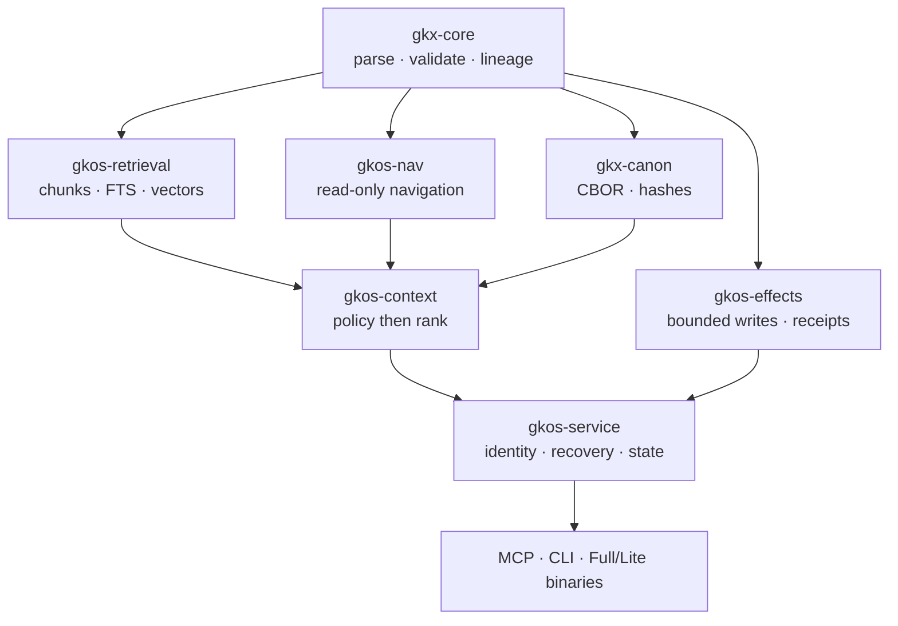

# GKOS-Engine Rust Retrieval & Operational Uplift

## Repository assessment and corrected integration/build plan (r4)

**Date:** 2026-08-27  
**Status:** Standards-committee recommendation; implementation plan, not release authority  
**Supersedes for execution:** r3 and Fable r2 as written  
**Build-time estimates:** intentionally omitted  

### Owner decisions incorporated in r4

1. GKOS-Engine 3.0 is reserved for the Rust rebuild. No `v3.0.0` tag exists before separately authorized cutover and cumulative gate completion.
2. Base Full and Lite distributions contain no model and never download one automatically.
3. `gkx-lite-local` is a separate offline distribution containing a pinned redistributable local model, hashes, licenses, manifest, runtime identity, and SBOM.
4. The product remains GKOS-Engine-Lite; `gkx-lite` and `gkx-lite-local` are executable/distribution names.
5. GKOS-Engine-Lite is projection-only. An authoritative currentness or governed-history request returns `requires_full_engine` and requires explicit caller resubmission to Full.

## 1. Evidence baseline

This assessment is pinned to the following live repository states:

| Repository / branch | Coordinate assessed | Status observed |
| --- | --- | --- |
| [`alphabet-h/grooveseek`](https://github.com/alphabet-h/grooveseek) `main` | [`91155cea0faa`](https://github.com/alphabet-h/grooveseek/commit/91155cea0faad963033129f78c3850e8221c4001) | Public, active, Rust workspace; package `1.0.0` |
| [`Odenknight/GKOS-Engine`](https://github.com/Odenknight/GKOS-Engine) `main` | [`2fbd4ec68ec8`](https://github.com/Odenknight/GKOS-Engine/commit/2fbd4ec68ec825b09e5194c9878a7ae90a281392) | TypeScript Engine `2.1.2`; canonical current implementation |
| GKOS-Engine retrieval stack | [PR #25](https://github.com/Odenknight/GKOS-Engine/pull/25) through [PR #29](https://github.com/Odenknight/GKOS-Engine/pull/29); top head `98f4faf22732` | Unreleased stacked uplift; head CI reported successful |
| [`Odenknight/GKOS-Engine-Lite`](https://github.com/Odenknight/GKOS-Engine-Lite) `main` | [`2ebbf77583af`](https://github.com/Odenknight/GKOS-Engine-Lite/commit/2ebbf77583af3e83032054f1256188dc56376907) | JavaScript wrapper / Tauri legacy line, package `1.1.3` |
| Engine-Lite retrieval stack | [PR #15](https://github.com/Odenknight/GKOS-Engine-Lite/pull/15) through [PR #19](https://github.com/Odenknight/GKOS-Engine-Lite/pull/19); top head `d1c0d5d60e53` | Unreleased future-static work; head CI reported successful |
| [`Odenknight/gkos-standard`](https://github.com/Odenknight/gkos-standard) `main` | [`6a7ad71fc027`](https://github.com/Odenknight/gkos-standard/commit/6a7ad71fc027894cd4e2bbb71c3bbadda06cd12f) | Published GKOS v0.80 plus the unpublished R17 amendment |

The supplied attachments are useful historical and explanatory material, but the v0.75 documents are not the current normative baseline. Where they differ, the live v0.80 Standard, its append-only [requirements registry](https://github.com/Odenknight/gkos-standard/blob/main/requirements/REGISTRY.md), and later ratified decisions control.

## 2. Executive determination

### Decision

**Adopt GrooveSeek as an operational and retrieval reference, not as the architecture or authority model for GKOS-Engine. Rebaseline the Rust rebuild around one Full-owned Rust workspace, and build projection-only GKOS-Engine-Lite as a distribution profile of those exact crates at the shared 3.0.0 cutover coordinate.**

The Fable r2 plan is directionally sound but **must not be executed unchanged**. Its strongest ideas should be retained: hybrid retrieval, derived SQLite indexes, exact citations, evaluation, watcher recovery, Streamable HTTP MCP, diagnostics, and model pinning. Its incorrect or incomplete portions must be replaced before implementation begins.

### Product disposition

1. **GKOS-Engine-Lite 1.x freezes as the legacy pre-Rust product line.** No Rust feature work is merged into that line. Security or release-integrity repair, if ever authorized, is handled as an exceptional 1.x maintenance action rather than a feature uplift.
2. **GKOS-Engine-Lite's Rust line remains projection-only and adopts Engine 3.0.0 verbatim at cutover under the existing one-train policy.** It must preserve the functional capability expected by everyday note users and add guided setup, ordinary-Markdown handling, local search, citations, graph/navigation, recovery, MCP, and optional proposal/effect surfaces without claiming governed currentness or Full authority.
3. **GKOS-Engine Full owns the single Rust implementation.** Lite does not maintain a copied parser, copied retrieval engine, copied contract pack, or independent semantics.
4. **TypeScript Engine 2.1.2 remains the compatibility oracle until every applicable compatibility, parity, recovery, crash, concurrency, packaging, downstream, and cutover gate passes.** It is not deleted merely because a Rust test suite is green.
5. **GKOS-Engine 3.0 is reserved for the Rust authority cutover.** Rust development before cutover is identified by commit SHA and non-release internal build identity. DDCV support alone cannot trigger 3.0, no Engine 2.2.x release is presumed, and reservation creates no tag or release authority.
6. **The current Full and Lite uplift branches are valuable evidence and prototype work, but not the correct final ownership topology.** Preserve their commits and test fixtures; selectively transplant their contracts and Rust components into the Full workspace.

### Overall assessment

| Area | Determination |
| --- | --- |
| GrooveSeek retrieval design | Strong reference; reuse concepts and test ideas |
| GrooveSeek security/authority model | Unsuitable for direct adoption |
| Fable r2 retrieval direction | Mostly correct |
| Fable r2 GKX field mapping | Incorrect in important places |
| Fable r2 Full/Lite workspace model | Correct goal, not matched by current branches |
| Existing Full uplift work | Strong TypeScript oracle, contracts, and evaluation evidence |
| Existing Lite Rust work | Strong seed for the future Full Rust retrieval crate, but not a complete product |
| Current readiness to release a Rust Engine | Not ready |
| Fundamental blocker to proceeding | None, if the ownership and effect boundaries below are adopted |

## 3. What GrooveSeek actually proves—and what it does not

GrooveSeek is a credible reference because it has shipped a broad Rust operator surface: Markdown and optional office-document parsing, heading chunking, SQLite/FTS5, `sqlite-vec`, FastEmbed/ONNX embedding, RRF, optional cross-encoder reranking, MMR, parent expansion, exact match spans, watcher operation, evaluation/tuning, stdio and Streamable HTTP MCP, a local operator page, cross-platform service helpers, release archives, and extensive tests. See its [README](https://github.com/alphabet-h/grooveseek/blob/91155cea0faad963033129f78c3850e8221c4001/README.md), [architecture](https://github.com/alphabet-h/grooveseek/blob/91155cea0faad963033129f78c3850e8221c4001/docs/ARCHITECTURE.md), and [retrieval pipeline](https://github.com/alphabet-h/grooveseek/blob/91155cea0faad963033129f78c3850e8221c4001/docs/retrieval-pipeline.md).

It does **not** prove that the same choices satisfy GKOS:

- GrooveSeek is a retrieval server; it is not a governed knowledge reference implementation.
- It has no GKX identity, branching-lineage, authority, canonical Context Manifest, Authorized Use Record, or governed effect model.
- Its HTTP MCP surface intentionally has **no built-in authentication**. It permits non-loopback binding only with an acknowledgement and delegates access control to the surrounding network. That is explicitly documented in its [HTTP client guidance](https://github.com/alphabet-h/grooveseek/blob/91155cea0faad963033129f78c3850e8221c4001/docs/clients.md) and [deployment topology](https://github.com/alphabet-h/grooveseek/blob/91155cea0faad963033129f78c3850e8221c4001/docs/deployment-topologies.md).
- Its embeddings and rerankers are not provider-neutral. The shipped implementation uses FastEmbed with enumerated local models. Its [embedder](https://github.com/alphabet-h/grooveseek/blob/91155cea0faad963033129f78c3850e8221c4001/grooveseek/src/embedder.rs) states that model files are downloaded into a cache and reused without content verification.
- It does not provide `as_of`, canonical supersession confirmation, or ledger-bound provenance.
- It can drop watcher batches after bounded-queue overflow and warn. GKOS recovery must instead force a later reconciliation so an observed event loss cannot become silent state drift.

Therefore, “proven by GrooveSeek” should mean **the crates and patterns have shipped together in one Rust product**. It must not mean they are proven on GKOS target hardware, under GKOS authority rules, with GKOS supply-chain controls, or at GKOS conformance depth.

## 4. Comparison: GrooveSeek, current Engine, and the Rust target

| Concern | GrooveSeek 1.0 | GKOS-Engine 2.1.2 / uplift branches | Required Rust target |
| --- | --- | --- | --- |
| Primary purpose | Search a local knowledge base | Deterministic GKX parsing, validation, projection, graphing, governance interfaces, and read-only Navigation | Same Engine responsibility, with retrieval and bounded operational services |
| Source authority | Files are the KB | GKX records and host-supplied governance boundaries | GKX remains canonical; ordinary notes remain explicitly non-governed |
| Identity | Path/document/chunk identifiers | Canonical GKX `uid`; valid UUIDv4 preserved, new UUIDv7 under applicable profile | One Rust identity implementation; no identity derived from rank/path/time |
| Lineage and time | No governed lineage/as-of model | Existing resolved lineage and half-open temporal projection | Projection candidates followed by canonical authorization/lineage confirmation |
| Retrieval | Mature hybrid local retrieval | Full uplift has TypeScript retrieval; Lite branch has a separate Rust adapter seed | One Full-owned Rust retrieval crate used by both products |
| Vector execution | FastEmbed + `sqlite-vec` | Full currently uses exact TypeScript similarity; Lite Rust defines provider traits but no shipped ONNX or `sqlite-vec` adapter | Exact portable baseline; `sqlite-vec` optional accelerator after target qualification |
| Providers | Enumerated local models | Contract seams for local ONNX, HTTP embeddings, and outbound MCP; adapters are not complete | Actual qualified adapters behind neutral traits; no silent substitution |
| Model integrity | First-run download/cache; cache content not hash-verified | Draft requirement for pins | Content-addressed model manifest; SHA-256 checked on every load |
| Validation | Optional frontmatter schema | Canonical GKX parser/validator plus new sealed ingest contracts | Two lanes: fail-closed claimed-GKX; explicit ordinary-Markdown profile |
| MCP | stdio + many-client HTTP | Current desktop REST is loopback/tokened; uplift has only an ADR for per-agent identity | stdio + Streamable HTTP; credential-bound agents, sessions, request IDs, limits, and audit |
| HTTP authentication | None | One shared desktop bearer token | One credential per agent at minimum; authorization checked per request |
| Navigation | Basic graph/topic tools | Navigation 2.1 is deterministic and source-content read-only | Navigation remains host-free; a composer combines it with retrieval |
| Writes | Rebuilds derived index only | Navigation proposes/diffs MOCs but does not apply them | Separate governed-effects subsystem for MOCs and agent notes |
| Conformance | Product compatibility promise | Reference implementation; Engine tests do not prove GKOS conformance | Engine-contract parity plus separately scoped GKOS requirement evidence |
| Packaging | Shipped Rust archives; Linux glibc 2.38+ for current model-enabled build | Node/npm/SEA plus Tauri legacy | Full native distribution plus projection-only Lite single-executable base profile; separate offline local-model bundle |

## 5. Assessment of the current Full and Lite uplift branches

### What is worth preserving

The existing branches have already produced substantial reusable work:

- exact baseline coordinates and ADRs;
- byte-stable TypeScript compatibility fixtures;
- versioned retrieval, provenance, ingest, and evaluation draft contracts;
- deterministic chunking, RRF/MMR, filters, confidence, citation, projection-generation, and recovery logic;
- temporal authorized-view work;
- a 24-query hermetic evaluation bundle and guarded candidate-configuration output;
- a Rust `gkos-retrieval-lite` crate with portable SQLite, deterministic ranking, stored projection verification, provider identities, bounded provider futures, and cross-language fixture tests;
- hosted green CI at the current Full PR #29 and Lite PR #19 heads.

This work materially reduces risk. It should become the **oracle and migration input** for the Rust workspace.

### Why it cannot be the final architecture

The Full uplift currently establishes a TypeScript reference retrieval implementation while Lite separately implements the same retrieval contract in Rust. The branches describe the Rust code as a pin-bound adapter, but the final Rust rebuild now changes the required ownership model: the Rust implementation must live in Full and be consumed directly by Lite.

There are also implementation gaps relative to r2:

- Full is still TypeScript, not a Rust workspace.
- Lite's Rust area is a library workspace with one retrieval crate; it is not a `gkx-lite` executable.
- The Lite Rust crate does not parse GKX and intentionally cannot do so.
- `local_onnx`, neutral HTTP embeddings, and outbound MCP are configuration/trait shapes, not complete qualified adapters.
- `sqlite-vec` and ONNX Runtime are not in the Lite Rust dependency set.
- MCP service, watcher, operator UI, model manifest, release packaging, MOC effects, and agent-note writes are not implemented in the Rust path.

### Recommended branch/PR disposition

1. Freeze the exact heads of Full PRs #25–#29 and Lite PRs #15–#19 in a migration manifest.
2. Do not merge the stacks to `main` as the permanent two-language architecture.
3. Create the Rust rebuild integration branch in **GKOS-Engine**, not Lite.
4. Import the contract packs, fixtures, and selected Rust retrieval code with provenance-preserving commits.
5. Revise/supersede ADR-0001, ADR-0002, and Lite ADR-0005 where they prescribe TypeScript Full plus a separate Rust Lite adapter.
6. After the new Rust workspace reproduces the preserved evidence, close the old draft stacks as superseded, linking the replacement PRs. Do not delete the branches or rewrite their evidence.
7. Keep Lite PRs #9, #13, and #14 out of the Rust 2.x merge chain. Any still-useful pin-hardening or naming text must be re-expressed against the frozen 1.x or new 2.x contract, not merged ambiguously across both.

## 6. Required corrections to Fable r2

### 6.1 Add canonical serialization before claiming ledger/context hashes

GKOS v0.80 requires GKX-CBOR-1 deterministic encoding and canonical hash binding for applicable GCP-6/GCP-7 artifacts (`GKOS-CANON-001..008`, `GKOS-CONTEXT-001..005`, and `GKOS-AUTHUSE-001..006`). R2 mentions content/ledger hashes but omits the canonical CBOR implementation needed to make those hashes interoperable.

**Correction:** add `gkx-canon` and its negative fixtures before canonical Context Manifest or Authorized Use claims.

### 6.2 Do not invent authored `valid_from` / `valid_to` GKX fields

The active Engine mapping uses canonical authored/projection semantics and treats `valid_from`/`valid_to` as retrieval-envelope names for existing temporal values. The current uplift ADR explicitly states they are not new authored frontmatter.

**Correction:** the chunk/result envelope may expose `valid_from` and `valid_to`, but ingest must read temporal state only through `gkx-core`'s canonical parser and resolved projection.

### 6.3 Support ordinary Markdown without pretending it is GKX

Requiring `gkx_id`, `created`, and `valid_from` on every file would make Lite hostile to everyday users and contradict the decided ordinary-Markdown boundary.

**Correction:** use two explicit ingest profiles:

- `governed_gkx`: a note claiming GKX must validate or be rejected whole;
- `ordinary_markdown`: searchable and citable, but marked `governance_standing = none`, without fabricated GKX identity, lineage, as-of standing, authority, or conformance.

### 6.4 Keep Navigation independent of retrieval

R2 makes `gkos-nav` consume `gkos-retrieval`. Current Navigation 2.1 deliberately remains deterministic value-in/value-out logic with no database, provider, watcher, or transport dependency.

**Correction:** add a `gkos-context` composition crate. It performs policy eligibility, calls retrieval, then supplies ranked eligible objects to Navigation/context assembly. `gkos-nav` itself depends only on core types.

### 6.5 Separate provider neutrality from protocol branding

The phrase “no vendor named in code or docs” conflicts with a provider type literally named `openai_compatible` and with mandatory model-specific defaults.

**Correction:** use neutral adapter families such as `http_embeddings_v1`, `http_rerank_v1`, `local_onnx`, and `outbound_mcp`. Actual model/vendor names are permitted only where unavoidable for a selected operator configuration, optional model-pack manifest, license notice, or interoperability note. They are not Engine policy or built-in routing preference.

### 6.6 Do not call incomplete adapters “proven”

GrooveSeek proves a local FastEmbed/ONNX path, not all three proposed provider adapters. The current Lite Rust branch defines traits/configuration but does not implement the complete transports or model runtime.

**Correction:** qualify each adapter separately with success, timeout, cancellation, malformed response, dimension, finite-value, item-correlation, credential-redaction, and concurrency tests.

### 6.7 Never degrade silently

R2 says a missing reranker silently skips. That conflicts with reproducibility and the project mantra of stability, reliability, then fidelity.

**Correction:** availability mode may return lexical/vector results when an optional stage fails, but every response must report the stage as `degraded` or `skipped`, with stable reason code and effective pipeline digest. Reproducible/strict mode fails when the declared pipeline cannot be executed exactly. No response may silently substitute a provider, model, vector space, or pipeline.

### 6.8 Treat MCP providers as outbound services, not inbound clients

“Call an embedding tool on any connected MCP server” conflates inbound Engine clients with outbound provider connections and can create re-entrancy, identity, and deadlock hazards.

**Correction:** `outbound_mcp` is a separately configured MCP client pool with its own credential, server identity, tool contract, timeout, concurrency limit, and circuit state. Inbound clients never become inference providers implicitly.

### 6.9 Reconcile multi-agent HTTP with the access-control boundary

R2 says access control is out of scope, then requires per-client bearer tokens. Remote multi-agent HTTP cannot responsibly ship without transport authentication and attributable identities.

**Correction:** enterprise IAM, tenancy policy, regulated-data policy, and organizational RBAC remain deployment concerns; **Engine-issued transport authentication, stable agent identity, request authorization hooks, and activity records are in scope**.

### 6.10 Do not turn an observed file deletion into semantic lineage

An external delete event does not prove authorized disposition or semantic supersession.

**Correction:** the watcher records `source_missing_observed`, preserves the last known source/projection evidence, removes the document only from the disposable current-search projection, and routes any governed tombstone/disposition through `gkos-effects` with authority, retention/hold evaluation, and a durable receipt.

### 6.11 Separate retrieval quality from GKOS conformance

Recall, MRR, and nDCG are product-quality metrics. GKOS conformance concerns include policy leakage, lineage/temporal eligibility, canonical selection capture, required omissions, authority, and receipts. A good nDCG does not establish GKOS conformance.

**Correction:** report two result families:

- `retrieval_quality`: Recall@k, MRR, nDCG, latency, and resource use;
- `governance_correctness`: temporal eligibility, permission/discoverability leakage, provenance/citation integrity, canonical manifest replay, refusal gates, and requirement-ID evidence.

### 6.12 Make `sqlite-vec` and local ONNX accelerators, not base blockers

The current GrooveSeek stack ships them, but that does not prove the Sandy/Ivy Bridge, Intel-Mac, musl, glibc, Windows, or static-link requirements for GKOS.

**Correction:** the mandatory base is FTS5 plus a deterministic exact-vector implementation when vectors are supplied. `sqlite-vec` is an optional accelerator until target qualification proves result equivalence and CPU safety. Local ONNX is a feature/model pack; lexical-only and remote-provider modes remain functional without it.

### 6.13 Resolve the “single static binary” / model-asset contradiction

R2 alternately says ONNX is embedded, shipped beside the binary, or fetched later. Those are different distribution contracts.

**Correction:** Lite's base release is one executable with no language runtime or adjacent native library. Optional models are data assets governed by a signed/hash-bound model manifest. Convenience archives may include a verified model pack, but the binary must remain fully useful in lexical-only mode.

### 6.14 Add the separately governed effects plane

R2 does not implement the already-requested near-real-time MOC maintenance, startup/shutdown recovery, or per-agent write directories.

**Correction:** add `gkos-effects`; do not weaken `gkos-nav` or let the retrieval database become a vault writer.

## 7. Corrected target architecture



### Workspace

```text
gkos-engine/
├── Cargo.toml
├── crates/
│   ├── gkx-core/             # sole GKX parser, validator, resolver, lineage model
│   ├── gkx-canon/            # GKX-CBOR-1, canonical hashes, refusal cases
│   ├── gkx-conformance/      # Engine adapters to Standard requirements/fixtures
│   ├── gkos-retrieval/       # chunking, FTS, vectors, fusion, citations, eval
│   ├── gkos-nav/             # port of Navigation 2.1; remains host-free/read-only
│   ├── gkos-context/         # policy eligibility + retrieval + Navigation composition
│   ├── gkos-effects/         # bounded MOC/agent-note effects and recovery receipts
│   ├── gkos-service/         # state, watcher, agents, sessions, operational activity
│   ├── gkos-mcp/             # stdio + Streamable HTTP transports
│   └── gkos-cli/             # shared command implementations
├── bins/
│   ├── gkx/                  # Full product
│   └── gkx-lite/             # projection-only Lite product/profile
├── contracts/                # one canonical copy, owned by Full
├── fixtures/                 # TS oracle + Rust + cross-product fixtures
├── eval/                     # hermetic and reviewed golden sets
├── docs/decisions/
└── THIRD-PARTY-NOTICES.md
```

### Dependency rules

- `gkx-core` has no retrieval, network, watcher, database, MCP, model, or UI dependency.
- `gkos-nav` depends on core types only.
- `gkos-retrieval` may depend on `gkx-core` and `gkx-canon`; it never depends on Navigation, MCP, CLI, or effects.
- `gkos-context` is the only normal composition point for policy-filtered retrieval plus Navigation/context assembly.
- `gkos-effects` cannot be imported by retrieval or Navigation.
- Full and Lite compile the same crates and contract versions. Lite is a distribution/UX policy, not another semantic implementation.

## 8. Product contract: Full vs projection-only Lite

| Capability | Full | Lite |
| --- | --- | --- |
| GKX parse/validate/project/lineage | Complete | Same crate and behavior |
| Ordinary Markdown | Supported with explicit non-governed status | Default-friendly path |
| Lexical/hybrid retrieval | Complete | Same engine; lexical enabled out of box |
| Local ONNX / HTTP / outbound MCP providers | Operator selectable | Same adapters; none mandatory |
| Citations and as-of | Citations plus ledger-confirmed current/as-of resolution | Citations and local lineage hints; authoritative current/as-of requests refuse with `requires_full_engine` |
| Navigation / MOC proposals | Complete | Guided commands and UI |
| Governed MOC apply / agent-note writes | Advanced policy controls | Safe presets; proposal-only default |
| MCP stdio | Yes | Yes |
| Multi-agent Streamable HTTP | Yes | Yes; loopback default, explicit remote enablement |
| Agent credential administration | Full CLI/API | Guided local administration; advanced flags available |
| Deployment | Service/container/native packages | One base executable plus optional model data |
| Conformance claims | Exact evidence scope only | Projection/fixture claims only; cannot establish GCP-6, GCP-7, Full equivalence, or governed currentness |

“Same features” means the same deterministic engine capabilities and result contracts. It does not require identical default configuration, documentation depth, or operator presentation.

## 9. Corrected integration and build plan

Every phase exits as `DONE`, `BLOCKED`, or `NEEDS_HUMAN`. A phase PR targets the Rust integration branch; it does not make a release claim. Acceptance criteria are cumulative.

### Phase 0 — Governance, coordinates, and migration freeze

1. Record the exact evidence coordinates in section 1 in a machine-readable migration manifest.
2. Freeze Engine-Lite 1.x as the legacy pre-Rust line. Document that it receives no Rust feature uplift.
3. Create the Rust integration branch in GKOS-Engine.
4. Add ADRs for single-Rust ownership, TypeScript-oracle retirement, Full/Lite product profiles, canonical serialization, provider/model supply chain, multi-agent identity, and the effects boundary.
5. Mark existing incompatible ADR clauses as superseded; do not rewrite their history.
6. Record planned disposition of Full PRs #25–#29 and Lite PRs #15–#19.

**Acceptance:** no implementation ambiguity remains about which repository owns semantics; no old PR is merged or closed without a replacement link; Lite 1.x freeze, shared 3.0.0 Rust cutover coordinate, and projection-only boundary are explicit. → `DONE`

### Phase 1 — Extract oracles, contracts, and compatibility corpus

1. Copy the Full-owned retrieval/ingest/evaluation draft packs once into the Full workspace.
2. Import the TypeScript 2.1.2 public API, CLI, graph, Graphiti, Navigation, parser, validation, lineage, and recovery fixtures.
3. Import the current Lite Rust conformance tests and seed code with attribution to its own repository/commit.
4. Create a cross-language runner that executes identical fixtures through TypeScript and Rust and classifies fields as byte-exact, semantically equivalent, intentionally changed, or unevaluated.
5. Preserve all valid UUIDv4 identities and every valid successor branch; never normalize historical source bytes merely to satisfy Rust.

**Acceptance:** fixture inventory and hashes are sealed; every difference has a disposition; the TypeScript oracle is runnable in CI. → `DONE`

### Phase 2 — Port `gkx-core` and canonical serialization

1. Port the parser, authoring/machine forms, projection, validation, identity, lineage, temporal behavior, resolver, sensitivity fail-closed behavior, graph identity, and deterministic serialization.
2. Implement GKX-CBOR-1 in `gkx-canon`: duplicate-key refusal, deterministic map order, typed numbers, negative-zero/NaN/infinity refusal, UTF-8/NFC rules, timestamp rules, and canonical hashing.
3. Keep source byte hashes, canonical artifact hashes, and derived projection digests as distinct typed values.
4. Port Navigation inputs only after core behavior is stable.

**Acceptance:** applicable TypeScript parity fixtures pass; all canonical negative fixtures refuse correctly; no mandatory behavior is `UNEVALUATED`; `gkx-core` has no host/runtime imports. → `DONE`

### Phase 3 — Build the retrieval store and deterministic pipeline

1. Move/rename the Lite Rust seed to Full-owned `gkos-retrieval`.
2. Implement deterministic heading chunking with algorithm version, exact source-byte boundaries, line coordinates, heading trail, source digest, optional canonical GKX identity, and temporal envelope derived only from core.
3. Use immutable, manifest-bound SQLite generations with FTS5 and atomic active-pointer swaps.
4. Provide deterministic exact vector scoring as the portability oracle; add `sqlite-vec` only behind an accelerator feature until qualified.
5. Execute stages in a reported order: eligibility/filtering → lexical/vector candidates → RRF → optional rerank → MMR → bounded parent expansion → final eligibility recheck.
6. Bind backend, tokenizer, chunker, model/provider, dimensions, pipeline parameters, policy, source snapshot, and contract versions into the projection manifest.

**Acceptance:** same input/config produces byte-identical chunks and projection manifests; corrupt/incompatible generations are rejected; FTS-only works on every target; accelerator and exact-vector candidate results are equivalent within a declared deterministic contract. → `DONE`

### Phase 4 — Implement provider and model supply-chain adapters

1. Define separate embedding and rerank traits with batch correlation, model ID, dimensions where applicable, configuration digest, timeout, and cancellation semantics.
2. Implement actual adapters for `local_onnx`, `http_embeddings_v1` / `http_rerank_v1`, and `outbound_mcp`.
3. Require a model manifest containing file digest, size, model identity, dimensions, source, license metadata, runtime requirements, and compatible adapter version.
4. Verify SHA-256 on every model load. A mismatch is a startup/configuration failure for that selected stage.
5. Base Full and Lite distributions MUST NOT download models. `gkx-lite-local` is delivered as a separate offline bundle. Any future downloader is a separately authorized product and cannot be enabled by first-run behavior in the base packages.
6. Redact secrets from logs/config digests and refuse credentials sourced from untrusted vault content.

**Acceptance:** all adapters pass success, malformed-result, wrong-count, wrong-dimension, nonfinite, timeout, cancellation, secret-redaction, and concurrency tests; lexical-only remains healthy; all degraded stages are explicit. → `DONE`

### Phase 5 — Citations, temporal search, and canonical context

1. Return exact UTF-8 `match_spans` whose byte slice equals returned text.
2. Distinguish source-byte hash, projection digest, and verified canonical ledger/artifact hash.
3. Full implements `--as-of` through projection candidates followed by core/ledger authorization confirmation. Lite must not perform this confirmation locally.
4. Default search returns only the captured current eligible view. Historical/superseded content requires `--as-of` or an explicit history option and is labeled.
5. Implement `gkos-context`: policy/discoverability filtering occurs before ranking; required contradiction, warning, restriction, omission, and lineage closure occurs before a Context Manifest can be sealed.
6. Capture the ranked selection as a canonical selection envelope before deterministic Context Manifest assembly.

**Acceptance:** Full historical fixtures return the correct branch/version without using ordering as authority; Lite returns `requires_full_engine` for authoritative currentness, supersession, governed-history, GCP-6, or GCP-7 requests; span equality passes across Unicode; identical Full canonical inputs reproduce identical Context Manifest bytes/hash; required omission fails closed. → `DONE`

### Phase 6 — Two-lane ingest, watcher reconciliation, and recovery

1. Implement `governed_gkx` and `ordinary_markdown` ingest profiles.
2. A malformed claimed-GKX record is rejected whole. An ordinary note is indexed with explicit non-governed standing.
3. Journal generation construction, validation result, publication intent, active-pointer swap, and recovery outcome.
4. Treat filesystem notifications as hints. On queue overflow, rename ambiguity, watcher restart, startup, or unclean shutdown, mark the corpus dirty and perform bounded subtree/full reconciliation.
5. Deletion removes current projection chunks only after reconciliation. It produces an operational missing-source observation, not semantic supersession or authorized disposition.
6. Add `status` and `doctor` coverage for configuration provenance, database integrity, projection/contract compatibility, model pins, provider reachability without content, watcher lag/dirty state, and recovery journal.

**Acceptance:** edits converge within the declared service objective; intentionally dropped events are recovered by reconciliation; crash at every publication boundary recovers to either the old or new complete generation; no partial source is searchable. → `DONE`

### Phase 7 — Multi-agent MCP and service identity

1. Implement stdio and Streamable HTTP through `gkos-mcp`.
2. Provision a stable Engine-issued `agent_id` per credential; issue a new `session_id` per initialization and `request_id` per operation.
3. Store only credential digests, nonsecret IDs, scopes, status, and bounded operational activity. Do not log note bodies, snippets, raw query text, or bearer tokens by default.
4. Re-evaluate credential status and authorization hook on every request so disable/rotation affects open sessions.
5. Add request-body, result-size, session, in-flight request, provider-call, timeout, and rate bounds.
6. Apply peer/Host/Origin/DNS-rebinding defenses as browser/network protections, not substitutes for authentication.
7. Default to loopback. Non-loopback binding requires explicit configuration, authenticated agents, and a declared TLS/reverse-proxy or equivalent transport boundary.
8. Minimum tools: `search`, `get_document`, `list_topics`, `get_lineage`, `validate_kb`, `rebuild_index`, `nav_context`, `status`, and scoped agent-note/MOC proposal tools.

**Acceptance:** two or more Kosmos-Oden/independent MCP clients operate concurrently; identities never collapse; one agent cannot read another's disallowed content or write directory; disable/rotation takes effect on the next request; unauthenticated HTTP is rejected. → `DONE`

### Phase 8 — Governed effects for MOCs and agent notes

1. Keep Navigation proposal/diff/audit pure and read-only.
2. Add `gkos-effects` with typed effects, authority hooks, optimistic preconditions, idempotency keys, atomic writes, archive/recovery rules, and State-Change Receipt binding.
3. Support MOC modes: `off`, `propose` (default), and explicitly authorized `auto_apply`.
4. Auto-apply only Engine-owned MOCs bearing valid ownership markers and an unchanged expected prior digest. A human-owned collision becomes `NEEDS_HUMAN`.
5. On apply: stage → validate → diff → receipt prebind → fsync → atomic replace → verify → archive prior version → finalize receipt. Failure rolls back or records verifiable compensation before “committed” is reported.
6. Generated/applied MOC content re-enters as a new Layer-1 source and inherits no upper-layer standing.
7. Provision agent note roots by credential scope. Default: `_kosmos/agent-notes/<agent-slug>/`. Prevent traversal, symlink/hard-link escape, cross-agent writes, deletion, and arbitrary overwrite.
8. Startup/shutdown recovery resolves incomplete effects before new writes are accepted.

**Acceptance:** unauthorized or indeterminate effects fail closed; human-authored content is never overwritten; crash-injection proves atomic recovery; every committed effect has a bound receipt; multi-agent write isolation passes. → `DONE`

### Phase 9 — Evaluation, tuning, and governance-correctness gates

1. Preserve the existing hermetic 24-query bundle and add reviewed real-corpus sets without regulated or private data.
2. Report Recall@k, MRR, nDCG, latency, memory, index size, and provider costs as retrieval quality.
3. Separately report temporal correctness, policy leakage, citation integrity, lineage completeness, canonical replay, and refusal evidence with requirement mappings where applicable.
4. Run CI regression gates only against deterministic lexical/fixed-provider environments. External/model variability produces an observation report, not a false deterministic gate.
5. `tune` emits a new candidate configuration only; it never edits or activates the current configuration.
6. Require human disposition for relevance disagreements and promotion of a tuned candidate.

**Acceptance:** a seeded ranking regression trips the quality gate; a seeded leakage/temporal error trips the governance gate; reverting clears each independently; no quality score is labeled GKOS conformance. → `DONE`

### Phase 10 — Rust Lite everyday-user experience

1. Build `gkx-lite` from the same workspace and crate versions as Full.
2. Provide `gkx-lite init` for folder selection, state location, ordinary/GKX explanation, local-only default, optional watcher, optional MCP, and optional model-pack selection.
3. Provide plain commands and helpful aliases for `add-folder`, `search`, `validate`, `graph`, `moc preview`, `moc apply`, `serve`, `status`, and `doctor` without hiding advanced flags.
4. Present every ordinary note as “searchable, not governed” until it is deliberately authored/admitted as GKX.
5. Default to lexical search, proposal-only MOCs, loopback MCP, no model, no network, and no automatic source writes.
6. Retain the 1.x repository history and migration guide; do not rewrite old notes or identities automatically.
7. Every result returns an explicit standing envelope. Minimum fields are `standing: projection_only`, `ledger_confirmation: unavailable`, `currentness: unconfirmed`, and `authorized_use: not_evaluated`.
8. Lite may parse, validate local structure, verify source/chunk hashes, expose declared-validity metadata, generate projections and citations, and return lineage hints. These capabilities do not establish ledger membership, authoritative governed historical state, semantic supersession, GCP-6 reproducibility, GCP-7 authorization, or Full equivalence.
9. Requests requiring any excluded authority return a structured `requires_full_engine` refusal. Lite does not automatically forward the request; the caller must explicitly resubmit it to a separately configured Full Engine.

**Acceptance:** a nontechnical user can point Lite at an ordinary Markdown folder, search with citations, enable watching, connect two local MCP clients, preview a MOC, recover from restart, and understand that every local result is projection-only—all without Node, Python, a model, or network access; authoritative requests deterministically refuse with `requires_full_engine`. → `DONE`

### Phase 11 — Packaging, hardware, and release qualification

1. Publish an honest feature matrix:
   - Full base and `gkx-lite`: lexical retrieval, vector/provider interfaces, model-manifest/hash machinery, citations, applicable Navigation, watcher, MCP, and effects surfaces; no model and no automatic model download;
   - `gkx-lite-local`: separate offline `gkx-lite` bundle plus one build-selected qualified local model/runtime pack;
   - remote adapters: base plus operator-configured HTTP/outbound MCP.
2. Qualify Linux x86_64/aarch64, macOS arm64, Windows x86_64, and a separately declared Intel-Mac base artifact if local ONNX cannot be shipped there.
3. Compile the mandatory x86_64 path without AVX2/FMA assumptions. Runtime-detect any accelerator.
4. Test on actual Sandy/Ivy Bridge-class hardware, including the R720 class, not only a QEMU flag mask.
5. Distinguish `musl static`, `gnu self-contained except system libc`, and platform-framework dependencies accurately. Never label all of them simply “static.”
6. Produce SBOM, dependency/license inventory, model manifests, checksums, provenance attestations, and per-target clean-machine reports.
7. Sign where infrastructure permits; disclose unsigned artifacts clearly.

**Acceptance:** base artifacts prove zero model files, zero vendor endpoints, and zero download-on-first-run behavior and pass clean-machine `doctor`, smoke, crash recovery, multi-agent, and CPU-floor tests; `gkx-lite-local` installs and runs offline and passes digest, redistribution-license, runtime, SBOM, and clean-machine checks; artifact claims match actual linkage. → `DONE`

### Phase 12 — Downstream integration and release cut

1. Integrate the Rust Engine into Kosmos-Oden through exact version/contract pins.
2. Test concurrent MCP sessions, policy filtering, context assembly, lineage, MOC proposal/effects, and agent-note isolation end to end.
3. Keep retrieval/index output as Projection-class derived state.
4. Run the eight-invariant documentation intent gate and update `DIVERGENCES.md`, `TRACEABILITY.md`, stability promises, migration guides, and third-party notices.
5. Retire the TypeScript oracle only after all compatibility, parity, recovery, crash, concurrency, packaging, downstream, and cutover gates pass and a separately authorized release decision is recorded.
6. Create `v3.0.0` only at the authorized Rust authority cutover. The tag must identify the exact accepted release commit and be verified remotely the same day as the authorized release merge.

**Acceptance:** Full and Lite are produced from one Rust source coordinate; Kosmos-Oden multi-agent HTTP integration passes; no unsupported GKOS profile claim is made; release artifacts and documentation are sufficient for a fresh operator to install, index, connect, recover, and audit. → `DONE`

## 10. Release and versioning recommendation

### Lite

- Freeze the existing pre-Rust line at 1.x.
- Release Rust GKOS-Engine-Lite as `3.0.0` only at the authorized Full Rust cutover, from the same accepted Rust source and contract coordinate.
- Use `gkx-lite` and `gkx-lite-local` as executable/distribution names; they do not create independent product-version lines.
- Preserve old 1.x files and identities as input; do not automatically rewrite them.

### Full

GKOS-Engine 3.0 is reserved for the Rust-rebuilt authority implementation.

1. Develop Rust crates under commit-bound internal or pre-release build identities; do not create a public `v3.0.0` tag.
2. Keep TypeScript 2.1.2 runnable as the compatibility oracle throughout development and cutover qualification.
3. A compatibility bridge may be built and tested, but no Engine 2.2.x release is presumed or required.
4. DDCV support, retrieval maturity, or a green Rust suite alone cannot trigger 3.0.
5. Create `v3.0.0` only when the cumulative compatibility, parity, recovery, crash, concurrency, packaging, downstream, and authority-cutover gates are `DONE` and the Initial Editor explicitly authorizes release.

GKX `2.0`, GKOS release `v0.80`, Engine product SemVer, and Lite product SemVer remain separate coordinates. Matching numerals never imply conformance.

## 11. Amended ground rules for the executor

1. GKOS Standard owns normative meaning; Engine owns implementation contracts; retrieval scores own neither.
2. Full owns one Rust semantic implementation. Lite is built from it, not beside it.
3. TypeScript 2.1.2 remains an oracle until formally retired.
4. Claimed-GKX ingest fails closed per record. Ordinary Markdown is accepted only under explicit non-governed standing.
5. Retrieval, graph, caches, indexes, and evaluation stores are disposable Projection-class artifacts.
6. Navigation stays source-content read-only. Source writes exist only in `gkos-effects`.
7. Base Full and Lite distributions contain no model, vendor endpoint, or download-on-first-run behavior. Every model in `gkx-lite-local` is pinned and hash-verified on every load.
8. No provider/model/routing preference in core behavior. Actual names appear only in operator-selected configuration, model/license manifests, or interoperability documentation.
9. No silent degradation or substitution. Effective stages and reason codes are returned and digest-bound.
10. Inbound MCP clients never become outbound inference providers implicitly.
11. Multi-agent HTTP requires authenticated agent identity and per-request authorization hooks; enterprise IAM/RBAC remains externally supplied.
12. Filesystem events are hints; uncertain event history triggers reconciliation.
13. Observed deletion is not semantic supersession or authorized disposition.
14. Retrieval quality metrics are not GKOS conformance results.
15. Mandatory x86_64 paths cannot require AVX2/FMA.
16. No regulated, sensitive, or private corpus enters fixtures without explicit owner authorization and an approved handling plan.
17. One phase produces at least one reviewable PR and exits only `DONE`, `BLOCKED`, or `NEEDS_HUMAN`.
18. No merge, tag, release, deployment, provider provisioning, or TypeScript retirement is implied by completing a development phase.

## 12. Owner decisions closed

- Rust authority release line: 3.0 reserved; tag only at authorized cutover.
- Base retrieval: no bundled model and no automatic model download.
- Local retrieval: separate offline `gkx-lite-local` bundle with pinned artifacts, hashes, licenses, runtime identity, and SBOM.
- Product naming: GKOS-Engine-Lite remains the product; `gkx-lite` and `gkx-lite-local` are distribution/executable names.
- Lite standing: projection-only with explicit standing envelope.
- Authoritative request behavior: structured `requires_full_engine` refusal and explicit caller resubmission.
- MOC default remains proposal-only unless a later owner ruling changes it.

## 13. Final committee recommendation

Proceed with the Rust uplift, but **do not continue the current Full-TypeScript / Lite-Rust split as the final architecture**. Preserve it as migration evidence. Move the Rust retrieval seed and all canonical contract ownership into GKOS-Engine, add the missing Rust GKX/canonical/effects/service layers, and compile Full and projection-only Lite 3.0.0 distributions from the same accepted crates and source coordinate.

GrooveSeek should remain a continuing upstream study coordinate for retrieval quality, operator experience, watcher behavior, MCP protocol handling, packaging, and regression tests. GKOS-Engine must exceed it in four places that define the project: canonical GKX lineage, explicit authority, reproducible governed context, and receipted bounded effects.

That produces the correct sequence:

> **Stability:** one semantic core and recoverable state.  
> **Reliability:** exact compatibility, explicit degradation, authenticated multi-agent operation, and crash-safe effects.  
> **Fidelity:** hybrid retrieval, local models, rich context, MOCs, UI, and advanced integrations.
